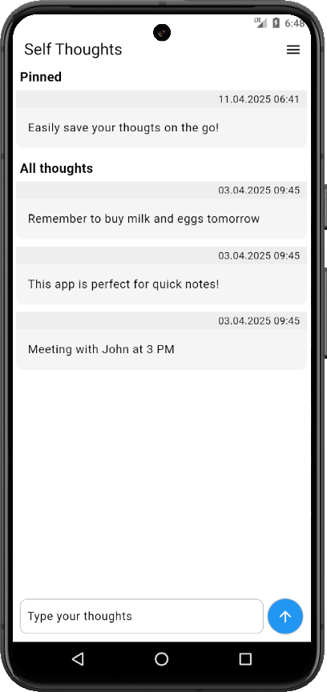

# Self Thoughts

Self Thoughts is a self-chatting app for storing personal thoughts, notes and messages 



## Getting Started

### Prerequisites
- Flutter SDK ([Flutter official site](https://flutter.dev/))
- Dart SDK (Comes with Flutter)
- IDE (choose what you like): 
    - [VS Code](https://code.visualstudio.com/)  
    - [Android Studio](https://developer.android.com/studio)

### Dependencies
- [shared_preferences](https://pub.dev/packages/shared_preferences)

### Installation
1. Clone the repo
```bash
git clone https://github.com/atomi19/password-generator.git
```

2. Navigate to the project directory:
```bash
cd open-calculator
```
3. Get dependencies:
```bash
flutter pub get
```

4. Run the project on iOS, Android or emulator


## License
This project is licensed under the [MIT](LICENSE.txt) License.